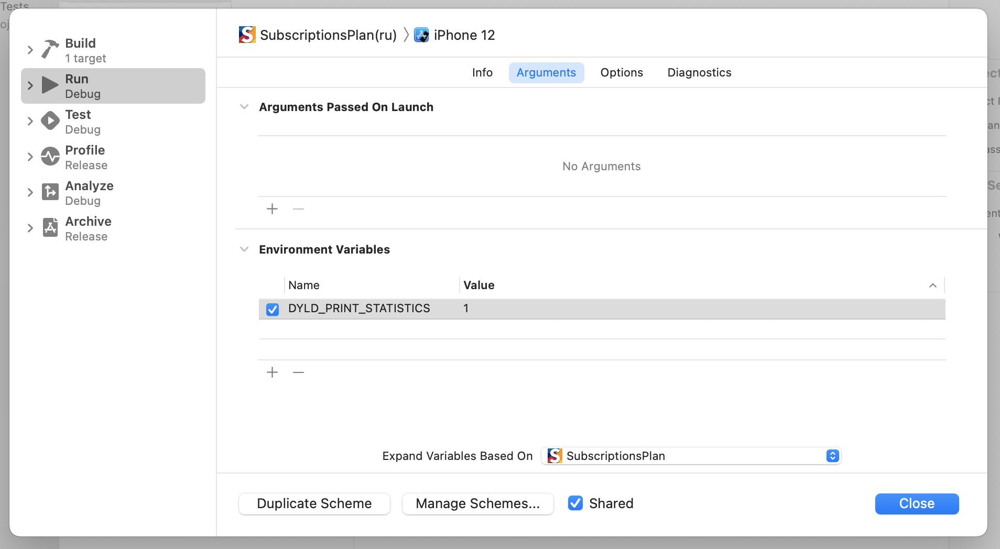

# Запуск и функционирование приложения

[К содержанию](./README.md)

## Содержание

- [Запуск приложения](./AppExecution.md#launch)
- [Процессы](#processes)
- [Потоки и многопоточность](./Thearding.md)
- [Управление памятью в iOS](./MemoryManagement.md)
- [RunLoop](./RunLoop.md)
- [Objective-C Runtime](./ObjectiveCRuntime.md)

## <a id="launch"></a>Запуск приложения

### Время запуска приложения

В общем случае время запуска приложения - это время, которое проходит от нажатия пользователем иконки приложения до отображения его интерфейса на экране. При этом выделяют следующие типы запуска:

- __Холодный запуск__ - данные о приложении отсутствуют в оперативной памяти или кэшэ ядра iOS. Обычно это происходит, когда приложение давно не запускалось или запускается первывй раз.
- __Теплый запуск__ - образ приложения присутсвует в кэшэ ядра iOS. Обычно это происходит, когда приложение запускалось недавно.
- __Горячий запуск__ - приложение находится в операвной памяти в состоянии `background` или `suspended`. Оно просто переводится в состояние `foreground`.

### Процесс запуска приложения

В общем случае процесс запуска приложения состоит из следующих шагов:

1. Запрос на запуск приложения. Им может быть запрос от пользователь (например, тап по иконке) или событие операционной системы (например, поступление push).
1. подготовка образа приложения (pre-main time);
1. запуск функции `main()` приложения, и соответственно, исходного кода приложения (post-main time).

> Несмотря на то, что разрабатывая iOS-приложения на Swift у вас нет прямого доступа к функции `main()`, она все еще существует, но вызывается скрытно.

#### Pre-main time

В первую очередь  в ОС [cоздается процесс](#processes) запускаемого приложения, в процессе чего под него [выделяется виртуальное адресное пространство] (./MemoryManagement.md).

Далее определяется, есть ли в кеше ОС образ приложения. При его наличии время запуска приложения может быть значительно уменьшено. Именно по этому запуск недавно закрытого приложения быстрее первого запуска приложения.

Подготовка образа включает в себя работу библиотеки `dyld` (динамический редактор ссылок), производящей загрузку библиотек, используемых в вашем приложении.

> Соответственно, чем меньше в приложении используется сторонних библиотек, тем быстрее время запуска.

##### Измерение pre-main time

Для того, чтобы измерять время, затрачиваемое на pre-main, необходимо:

- Перейти к настройкам текущей схемы.
- В разделе `Run`, в вкладке `Arguments` добавить `Enviroment Variables`:
	- `DYLD_PRINT_STATISTICS` со значением `1`.



После этого в процессе запуска на консоли отобразится текст примерно следующего содержания:

```
Total pre-main time: 234.31 milliseconds (100.0%)
         dylib loading time: 225.03 milliseconds (96.0%)
        rebase/binding time: 126687488.9 seconds (141572795.5%)
            ObjC setup time:  10.89 milliseconds (4.6%)
           initializer time:  40.16 milliseconds (17.1%)
           slowest intializers :
             libSystem.B.dylib :   2.44 milliseconds (1.0%)
   libBacktraceRecording.dylib :   6.49 milliseconds (2.7%)
    libMainThreadChecker.dylib :  25.98 milliseconds (11.0%)
```

### Post-main time

Post-main time включает в себя все, что происходит с приложением начиная с запуска функции `main()` и в общем случае включает в себя следующие шаги:

1. Запуск функции `main()`.
> Как говорилось ранее, несмотря на то, что вы не видите функцию `main()` в составе проекта, она добавляется на этапе компиляции и скрытно вызывается при запуске.
> 
> В Swift 5.3 появился атрибут `@main`, как и `@UIApplicationMain` позволяет определить точку входа в приложение, но при этом дает большую гибкость.

1. Запуск функции `UIApplicationMain(_:_:_:_:)` фреймворком `UIKit`. Данная функция принимает данные о запускаемом приложении и причине его запуска.
1. Создается экземпляр типа `UIApplication`, соответсвующий приложению, и его делегат `AppDelegate`.
> Одному приложению всегда соответствует только один экземпляр `UIApplication`.

1. Если у приложения есть стандартный storyboard-файл, то происходит его загрузка. 
1. Вызовается метод `application(_:willFinishLaunchingWithOptions:)`.
1. Вызывается метод `application(_:didFinishLaunchingWithOptions:)`.
1. Создает делегат сцены `SceneDelegate`.
1. Вызывается метод `scene(_:willConnectTo:options:)`, в котором создается экземпляр окна `UIWindow` и происходит загрузка интерфейса.

> Для того, чтобы уменьшить время запуска приложения и создать положительный UX, рекомендуется исключить из этапа загрузки приложения загрузку всех необзательных данных, получение которых может быть отложено. 
> 
> Если после запуска есть возможность показывать/использовать "устаревшие" данные, то отложите загрузку обновлений до этапа отображения первого интерфейса.

## <a id="processes"></a>Процессы

После запуска приложения в операционной системе создается процесс, для которого в оперативной памяти выделяется пространство (виртуальное адресное пространство).

__Процесс__ - абстракция, объединяющее в себе независимое виртуальное адресное пространство в оперативной памяти и дополнительные ресурсы (например файлы).

__Процесс__ - это экземпляр запущенного приложения.

Обычно запущенному приложению соответствует один процесс, но в некоторых случаях разработчиком (не под iOS) может быть реализована иной подход. Так, например, браузер Google Chrome для каждой вкладки создает отдельный процесс, чтобы исключить возможность взаимодействия вкладок между собой.

>
> В iOS для одного приложения всегда создается только один процесс.
>

Процессы по умолчанию не могут взаимодействовать между собой и для организации этого взаимодействия требуется использовать дополнительные возможности, вроде общих файлов, сокетов (socket), портов (port). Так же в зависимости от используемой платформы могут быть доступны другие средства обмена. В iOS можно использовать Pipe, App Groups, Share Extension, Custom URL Scheme и другие (подробнее в ["Передача данных между приложениями"](/PassDataProcesses.md)).

В iOS и macOS все пользовательские процессы создаются процессом с названием `launchd` (PID = 1). Для создания дочерних процессов в macOS можно использовать класс `Process`. В iOS нет возможности самостоятельно создавать дочерние процессы.

После запуска в рамках процесс создается главный поток ([thread](/Thearding.md)), в рамках которого автоматически запускается [RunLoop](/RunLoop.md) и в дальнейшем выполняются все инструкции.

В текущее время, так как iOS и приложения, написанные на Swift, все еще во многом функционируют за счет библиотек, написанных на Objective-C, в памяти устройства находится [Objective-C Runtime](/ObjectiveCRuntime.md) - библиотека времени исполнения, обеспечивающая доступ ко многим функциональным возможностям операционной системы. Один из знакомых вам вариантов взаимодействия с ней является использование аттрибута [`@objc`](/ObjectiveCRuntime.md#objc).

## Дополнительная информация

- [Entry Points in Swift: How @main and @UIApplicationMain work internally](https://swiftrocks.com/entry-points-swift-uiapplicationmain-main)
- [Understanding the aspects of iOS App Launch Time](https://medium.com/tokopedia-engineering/understanding-the-aspects-of-ios-app-launch-time-9b579534625f)